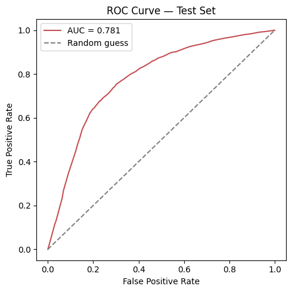
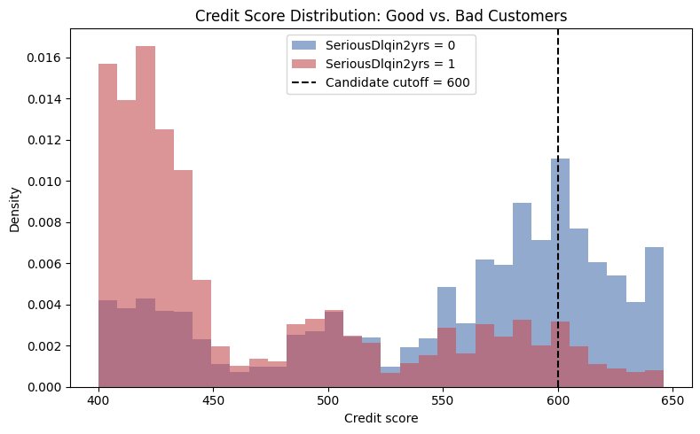

# Credit Risk Scorecard

A credit risk scorecard that estimates the probability a customer will default
within two years, built on the [Give Me Some Credit](https://www.kaggle.com/c/GiveMeSomeCredit)
dataset (Kaggle). The scorecard approach is widely used in banking because it
produces both a probability of default (PD) **and** a simple, interpretable
point score a loan officer or customer can understand — no black box.

**Validated result:** on a held-out test set the finished scorecard separates
risk cleanly — customers scoring **≥ 600 default at 1.31%**, while those
**< 600 default at 8.72%**, a roughly 6.7x difference, on data the model never
saw during training.

## Highlights

- End-to-end pipeline: raw CSV → SQLite → SQL-based EDA → WoE/IV feature
  engineering → logistic regression → points-based scorecard → out-of-sample
  validation
- **Leakage-safe by design**: the train/test split happens before any
  data-derived statistic (median income, WoE tables) is computed, so nothing
  about the test set ever leaks into feature engineering
- **Evidence-based feature selection**: an Information Value screen across
  all 10 candidate variables justifies the final feature choice, rather than
  picking variables by assumption
- **Threshold analysis, not just a single cutoff**: compares five probability
  thresholds and shows explicitly why the default 0.50 threshold fails on
  this imbalanced dataset (6.7% default rate)
- Heavily commented notebook — every transformation explains *what* it does
  and *why*, intended to be readable by someone new to credit scoring

## Results

| Metric | Value |
|---|---|
| AUC (test set) | 0.78 |
| Information Value — Utilization | 1.06 |
| Information Value — 90+ days late | 0.90 |
| Information Value — Age | 0.23 |
| Default rate, score ≥ 600 (test set) | 1.31% |
| Default rate, score < 600 (test set) | 8.72% |
| Overall test-set default rate | 6.68% |

**ROC Curve**



**Score Distribution — Good vs. Bad Customers**



## Methodology

### 1. Setup & Data Load
Load the raw dataset into pandas, then persist it into a SQLite database for
SQL-based exploration.

### 2. SQL-based Exploratory Data Analysis
Query the SQLite table directly (`sql/eda_queries.sql`) to check the overall
default rate, scan for invalid ages and utilization outliers, and quantify
missing values before touching the data.

### 3. Data Cleaning & Feature Engineering
- Fixed business-rule caps applied first (age floor of 18, utilization capped
  at 100%, delinquency counters capped at 10) — these don't depend on the
  data's statistics, so they're safe to apply before splitting.
- **Train/test split (70/30, stratified)** happens next, before any
  data-derived value is computed.
- Median income imputation and Weight of Evidence (WoE) tables are fit **on
  the training set only**, then applied to the test set — avoiding a common
  data-leakage mistake in scorecard projects.
- An Information Value screen across all 10 candidate variables justifies
  the final choice of age, income, and utilization as the scorecard's three
  features (with delinquency history noted as the natural next addition for
  a production-grade scorecard).

### 4. Scorecard Model
- Logistic regression trained on WoE-encoded features, evaluated by AUC and
  ROC curve on the held-out test set.
- A threshold comparison table shows why the default 0.50 cutoff is
  unusable on this imbalanced data (0% recall on actual defaulters), and
  why a lower cutoff is a more defensible choice.
- Model coefficients converted into a points-based scorecard using the
  standard Points-to-Double-the-Odds (PDO) methodology (base score 600,
  base odds 50:1, PDO 50).
- **Final validation on the untouched test set**: a 600-point cutoff is
  shown to genuinely separate future default risk, not just fit the data
  the scorecard was built from.

## Repository Structure

```
credit-risk-scorecard/
├── data/                 # raw data (not tracked in git — see Setup below)
│   ├── cs-training.csv
│   └── credit_data.db    # generated by the notebook, Stage 1
├── notebooks/
│   └── credit_scorecard.ipynb   # full workflow, Stages 1-4
├── sql/
│   ├── eda_queries.sql          # exploratory SQL queries (Stage 2)
│   └── schema_and_load_notes.md # how the SQLite table is created
├── reports/
│   ├── roc_curve.png
│   └── score_distribution.png
├── requirements.txt
├── .gitignore
├── LICENSE
└── README.md
```

## Setup

1. Clone the repo and install dependencies:
   ```bash
   git clone https://github.com/<your-username>/credit-risk-scorecard.git
   cd credit-risk-scorecard
   python -m venv venv
   source venv/bin/activate   # Windows: venv\Scripts\activate
   pip install -r requirements.txt
   ```
2. Download `cs-training.csv` from the [Give Me Some Credit Kaggle competition](https://www.kaggle.com/c/GiveMeSomeCredit/data)
   and place it in `data/cs-training.csv` (raw data isn't tracked in this repo
   — see `.gitignore`).
3. Launch Jupyter and run the notebook top to bottom:
   ```bash
   jupyter notebook notebooks/credit_scorecard.ipynb
   ```

## Scope & Next Steps

This scorecard deliberately uses three features (age, income, utilization)
to keep the WoE → logistic regression → points pipeline easy to follow
end-to-end. The Information Value screen in Stage 3 shows that delinquency
history (`NumberOfTimes90DaysLate` and related counters) carries even
stronger signal — the natural next step for extending this into a
production-grade scorecard.

## License

MIT — see [LICENSE](LICENSE).
